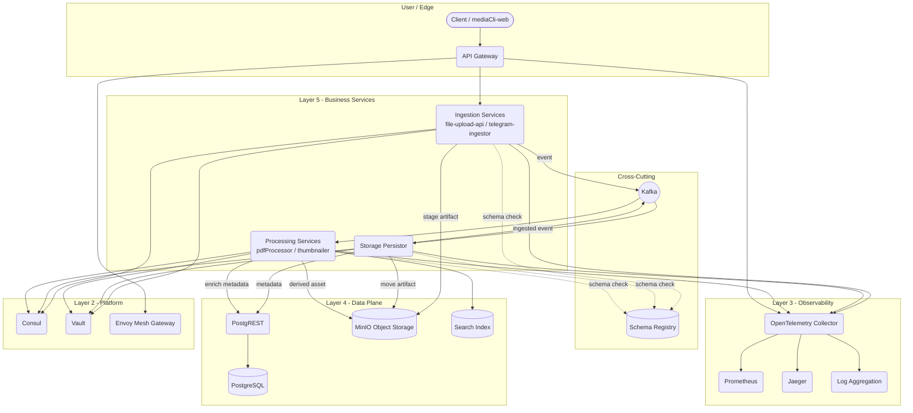

# Platform Architecture Blueprint

## Purpose
Provide a current, navigable view of how MyFarsi's media platform fits together so teams can evolve the stack without guessing at cross-domain dependencies or hidden assumptions.

## Domain Map
Services are grouped by numbered directories at the repo root. Treat each directory as the source of truth for designs and runbooks.

| Domain | Scope | Key References |
| --- | --- | --- |
| Configuration Backbone | Consul, Vault, mesh gateways, config tooling | `01_conf_mgmt/config-management.md`, `01_conf_mgmt/consul.md`, `01_conf_mgmt/mesh-gateway.md`, `90_cli_tools/config-cli.md` |
| CI/CD & Image Supply | Runners, registry, GitOps automation | `02_cicd_mgmt/cicd-runner.md`, `02_cicd_mgmt/docker-registry.md`, `02_cicd_mgmt/gitops-repository.md` |
| Observability | Telemetry collection, tracing, dashboards | `03_telemetry/observability-platform.md`, `03_telemetry/tracing-platform.md` |
| Data Plane | Storage, APIs, search | `22_db_back/postgres-api-platform.md`, `21_content_manager/minio-content-server.md`, `23_search_back/search-elasticsearch.md` |
| Messaging Core | Durable event transport | `20_central_bus/kafka-messaging-bus.md` |
| Media Workflow | Ingestion, processing, presentation | `31_Extraction/media-platform.md`, `51_Presentation_back/logic-router.md`, `52_Presentation_front/` (placeholder) |
| Access & Identity | Authentik, forward-auth | `11_athentik_user/authentication.md`, `11_athentik_user/authentik-hybrid-identity.md` |

Shared orientation docs live at `DESIGN.md`, `SystemReqs.md`, and `AGENTS.md`. Update them whenever you add or retire a domain.

## High-Level Topology
The platform follows a layered claim-check model: clients hand off media at the edge, Kafka propagates pointer events, and downstream services hydrate storage, indexing, and derived assets. Cross-cutting services (configuration, observability, schema governance) sit beside the runtime path so feature teams can focus on business logic while relying on consistent platform primitives.

## Layer Responsibilities
- **Layer 5 - Business Services** Handle protocol mediation, validation, orchestration, and publish immutable events instead of chaining synchronous calls. Each service exposes OTLP telemetry and registers with Consul.
- **Layer 4 - Data Plane** PostgREST fronts PostgreSQL for metadata, MinIO stores binaries, and search backends index enriched content. The Storage Persistor is the authoritative bridge between Kafka pointers and durable state.
- **Messaging & Schema** Kafka supplies durable, replayable events; Schema Registry enforces compatibility. Topics map to domain events (`media_ingested`, `asset_enriched`, etc.).
- **Layer 3 - Observability** OpenTelemetry Collector normalizes signals from all services, routing metrics to Prometheus, traces to Jaeger, and logs to the chosen aggregation backend. Dashboards and alerts are documented in `03_telemetry/observability-platform.md`.
- **Layer 2 - Platform** Consul delivers configuration and service discovery, Vault issues identities and secrets, and Envoy-based gateways provide north-south and east-west policy control. Services bootstrap configuration through `config-cli` before starting workloads.
- **Layer 1 - CI/CD (out of scope for this doc)** Lives in `02_cicd_mgmt/` and seeds artifacts consumed by the layers above.

## Core Workflows
1. **Ingestion**: gateway forwards validated uploads to ingestion services, which stage objects in MinIO and emit pointer events on Kafka. Config and secrets are fetched from Consul/Vault at startup and refreshed on demand.
2. **Persistence**: storage persistor consumes pointer events, performs idempotent moves to durable buckets, writes metadata via PostgREST, and publishes `media_ingested`.
3. **Processing**: downstream processors subscribe to relevant topics, fetch artifacts, enrich metadata, update search indexes, and emit follow-on events for additional consumers.
4. **Observability**: every hop ships logs/metrics/traces via OTLP. Golden signals (ingestion latency, Kafka lag, error rate) must remain within SLOs captured in `03_telemetry/observability-platform.md`.

## Operational Guardrails
- **Resilience**: run Kafka in KRaft mode with RF=3, enable MinIO versioning, and rotate Vault tokens automatically. Validate failover drills quarterly (broker loss, MinIO outage, Vault unavailability).
- **Contracts**: Schema evolution requires compatibility checks and fixture updates. Reference sample payloads in `20_central_bus/kafka-messaging-bus.md`.
- **Security**: Never embed secrets in manifests; rely on Vault paths and Consul ACLs. Document policy changes in the owning domain directory.
- **Change Management**: Architectural changes must update this blueprint plus domain-specific docs. Capture consequential shifts in ADRs inside the relevant directory (e.g., `20_central_bus/adr/` when created).

## Next Actions
1. Publish a lightweight ADR index (one per domain) so new decisions remain traceable.
2. Extend the diagram with control-plane components (CI/CD runners, config-cli flow) once those services move beyond design.
3. Annotate data residency and retention expectations ahead of multi-region expansion.
