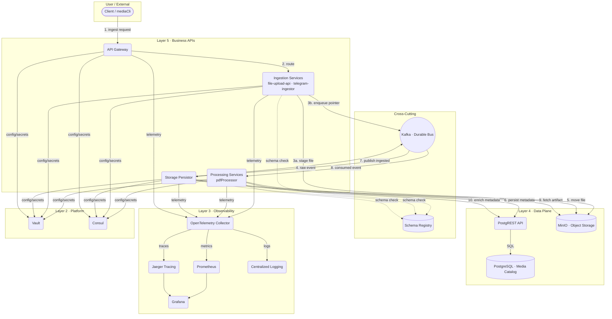

# Platform Architecture Blueprint

## Purpose
Outline how MyFarsi services interact across ingestion, storage, and delivery so teams share a single mental model when extending the platform or introducing new workloads.

## Service Domains
- **Configuration Management System** (namespace/cluster `platform-config`) operates its own Consul and Vault instances, exposes `config-cli` artifacts, and doubles as the configuration backbone for CI/CD runners and pipelines (see `designs/config-management.md`, `designs/config-cli.md`, `designs/consul.md`).
- **Authentication System** (namespace/cluster `authn`) hosts Authentik + forward-auth with a dedicated Consul/Vault pair for its runtime needs (`designs/authentication.md`).
- **Media Business Logic** (namespace/cluster `media-core`) houses ingestion, catalog, and processing services with their own Consul/Vault (`designs/media-platform.md` plus subsystem designs).

Each domain runs independently; cross-domain dependencies are limited to published APIs (e.g., Authentik OIDC) and shared ingress for Consul when consuming configuration from the configuration management system.

## High-Level Topology
The system follows a layered claim-check pattern: clients submit media to the edge, metadata travels over Kafka, and downstream services hydrate persistent stores. Cross-cutting concerns—schema governance, configuration, observability—sit beside the runtime path to keep feature services focused on business logic.

## Layer Responsibilities
- **Business APIs (Layer 5)** Own request validation, protocol translation, and orchestration. Each service emits domain events rather than calling downstream synchronously.
- **Cross-Cutting Services** Kafka plus Schema Registry provide durable messaging and contract enforcement. They decouple producers/consumers and protect downstream services from breaking changes.
- **Data Plane (Layer 4)** PostgREST fronts PostgreSQL for CRUD access, while MinIO stores raw binaries. StoragePersistor is the bridge that materializes metadata and moves objects.
- **Observability (Layer 3)** OpenTelemetry Collector aggregates traces, metrics, and logs, fanning out to Prometheus, Jaeger, and logging sinks so teams troubleshoot with consistent context.
- **Platform (Layer 2)** Consul and Vault distribute configuration, service discovery, and secrets; they backstop zero-trust networking and environment bootstrap. Containers typically launch via `config-cli` (see `designs/config-cli.md`) to hydrate configuration from Consul before starting workloads.

## Core Workflows
1. **Ingestion** Clients upload media through the API Gateway; ingestion services stage the binary in MinIO and post a pointer event.
2. **Persistence** StoragePersistor consumes the raw event, moves objects into long-term storage, and records metadata through PostgREST.
3. **Processing** Processing services react to the ingested topic, enrich assets, and publish downstream updates.
4. **Observability** Every hop emits telemetry via OTLP; dashboards and alerts align on shared signal names.

## Operational Considerations
- Use KRaft-based Kafka with three brokers and triple replication to survive AZ loss.
- Schema Registry enforces backward compatibility before promotion.
- Vault-issued identities secure service-to-service calls and limit blast radius.
- Consul service mesh governs traffic policies, while API Gateway enforces edge security.

## Reference Designs
- Configuration management tooling: `designs/config-cli.md`, `designs/consul.md`
- Configuration management system overview: `designs/config-management.md`
- Identity stack: `designs/authentication.md`, `designs/adr/002-authentik-subsystem-decisions.md`
- Media services: `designs/media-platform.md`, `designs/content-management.md`, `designs/minio-content-server.md`, `designs/postgres-api-platform.md`, `designs/search-elasticsearch.md`, `designs/kafka-messaging-bus.md`
- Mesh gateways: `designs/mesh-gateway.md`
- Image versioning & tagging: `designs/docker-image-versioning.md`
- Observability & tracing: `designs/observability-platform.md`, `designs/tracing-platform.md`
- CI/CD runners and GitOps: `designs/cicd-runner.md`, `designs/gitops-repository.md`
- Overall platform guidance: `designs/DESIGN.md`

## Next Actions
1. Codify the diagram in the architecture ADR to keep drift in check.
2. Validate failover paths quarterly (Kafka broker loss, MinIO outage, Vault unavailability).
3. Expand the model with data residency annotations once multi-region work begins.
